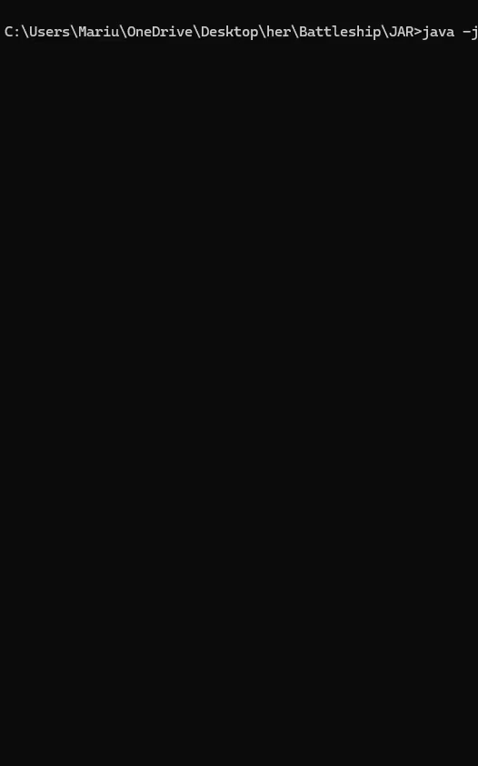

## Description

This project is my from-scratch implementation of the classic board game, Battleship, developed during my Bachelor's studies at UiB. Implemented as a single-player experience against the computer, this console-based game features both the setup phase for placing ships on the board and the gameplay phase where players take turns firing at each other's boards. Included in this project is the corresponding JAR file.

## Preview

Depicted are the setup phase along with the initial gameplay phase.

## How to Use

To play the game, simply run the provided JAR file.

## Dependencies

Uses the org.junit package in Java for testing purposes.

## Author
Marius H. Naasen, originally created in the spring of 2019 as part of the object-oriented programming course [INF101](https://www4.uib.no/en/courses/INF101) at UiB.
